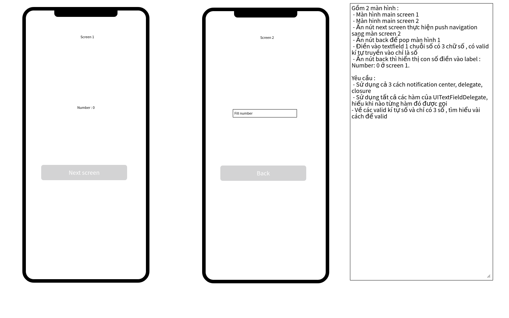

# Closure, Delegate and Notification Center

Đây là tài liệu nói cách sử dụng, phân biệt cũng như định nghĩa của closure, delegate và notification.

# Delegate: 
-  Là design pattern dùng để truyền dữ liệu giữa các class hoặc struct. 
- Delegate thường được sử dụng cho các UI (text field, table view, button,...)
- VD: Ta có 2 class View Controller (VC) và View Controller 2 (VC2). Nhiệm vụ của chúng ta là ở VC2 khi điền 1 số có 3 chữ số vào textfield thì ở bên VC và ấn button BACK, VC2 sẽ trở về VC và label ở VC sẽ hiển thị text giống như số ta điền trên textField. Vấn đề là label ở VC ta không thể tham chiếu trong VC2 được. Do đó ta cần phương thức giao tiếp giữa 2 class này, và delegate sẽ có tác dụng làm điều đó.

+) Đầu tiên tạo 1 protocal có function giúp ta thay đổi text của label theo textfield:
        
        protocol ScreenDelegate {
            func changeLabel(text: String)
        }
        
+) Tiếp theo tạo thuộc tính delegate ở VC2:
        
        var delegate: ScreenDelegate?
        
+) Sau đó chúng ta truyền data vào function trong delegate. Ở đây khi thực hiện ấn button back ta sẽ thực hiện delegate thay đổi label:
        
           @IBAction func btnBackClicked(_ sender: Any) {
                if checkValidTextField() {
                //Delegate
                    delegate?.changeLabel(text: tfNumber.text ?? "")
                    self.navigationController?.popViewController(animated: true)
                }
            }

+) Sau đó chúng ta sẽ implement ScreenDelegate trong VC: 

        extension ViewController: ScreenDelegate {
        }

+) Ở đây sẽ gán việc khi chuyển từ VC sang VC2 thì delegate của nó chính là VC:

    @IBAction func btnChangeScreenClicked(_ sender: Any) {
            let screen2 = self.storyboard?.instantiateViewController(withIdentifier: "ViewController2") as! ViewController2
            screen2.delegate = self
            self.navigationController?.pushViewController(screen2, animated: true)
        }

+) Cuối cùng chúng ta sẽ handle dữ liệu truyền qua thông qua function changeLabel: 

    extension ViewController: ScreenDelegate {
        func changeLabel(text: String) {
        lblNumber.text = "Number: \(text)"
        }
    }
    
    
# Closure 
- Là 1 cấu trúc đặc biệt được bao đóng bởi 2 dấu {} (Block). 
- Nó có thể dùng như 1 biến hoặc 1 function
- Nó được sử dụng như 1 func bình thường
- Thường được sử dụng trong các xử lý đồng bộ (asynchronous)
VD: 
    +) Sử dụng ví dụ ở trên, đầu tiên ta cần khai báo 1 closure xử lý việc thay đổi text ở label ở VC2. Ta khai báo closure ở đây dạng 1 biến có đầu vào là String và trả về là Void:

        var closure: ((String) -> Void)?

    +) Sau đó, khi ấn button back ta sẽ thay đổi label nên ta sẽ khai báo ở đó và có đầu vào là text của textfield:
        
        @IBAction func btnBackClicked(_ sender: Any) {
            if checkValidTextField() {
            closure?(tfNumber.text ?? "")
            self.navigationController?.popViewController(animated: true)
            }
        }

    +) Ở bên VC, ta thực hiện thay đổi text của label như sau:

        @IBAction func btnChangeScreenClicked(_ sender: Any) {
            let screen2 = self.storyboard?.instantiateViewController(withIdentifier: "ViewController2") as! ViewController2
                screen2.closure = { (text) in
                self.lblNumber.text = text
            }
            self.navigationController?.pushViewController(screen2, animated: true)
        }

# Notification Center
- Cũng có chức năng giống như delegate nhưng vì delegagtion sẽ không giúp broadcasting singles hoặc thông báo các phương thức cùng một thời điểm nên thay vì sử dụng delegate, ta sẽ sử dụng Notification Center.
- Về cơ bản, nó giúp cho việc observation và broadcasting singles từ một class đến nhiều class.
- Post singles từ một class đến nhiều class.
- Nhận singles từ nhiều class.
-VD: 
    +) Để sử dụng notification center, đầu tiên ta phải có 1 key name để phân biệt vs các notifcaiton khác: 
        
        let name = Notification.Name("didReceiveData")
        
    +) Ta sẽ sử dụng post để post data ở VC2 đến notification center với key name và có userInfor là 1 dictionary. Ở đây dictionnary có key là "text" và value chính là text của textfiled:
    
        @IBAction func btnBackClicked(_ sender: Any) {
            if checkValidTextField() {
                NotificationCenter.default.post(name: name, object: nil, userInfo: ["text": tfNumber.text ?? ""])
                self.navigationController?.popViewController(animated: true)
            }
                
    +) Ở VC, ta sẽ đăng ký nhận thông báo để receiving bằng phương thức addObserver và viết 1 func để khi nhận được thông báo sẽ thực hiện thay đổi text ở label:
    
            override func viewDidLoad() {
                super.viewDidLoad()
                NotificationCenter.default.addObserver(self, selector: #selector(changeText), name: name, object: nil)
            }

            @objc private func changeText(_ notification: Notification) {
                let data = notification.userInfo
                if data != nil {
                    lblNumber.text = data!["text"] as? String
                }
            }
            
    +) Cuối cùng ta phải remove notification để tránh bị gọi nhiều lần:
    
        deinit {
            NotificationCenter.default.removeObserver(self)
        }
