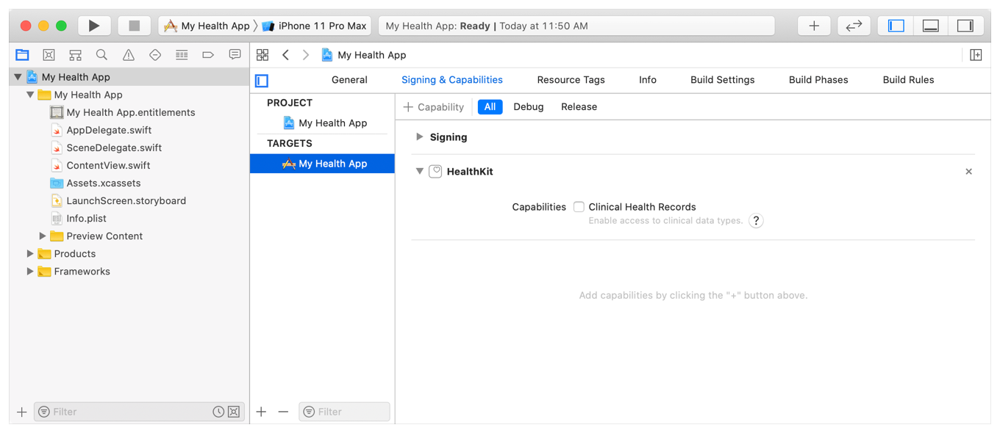
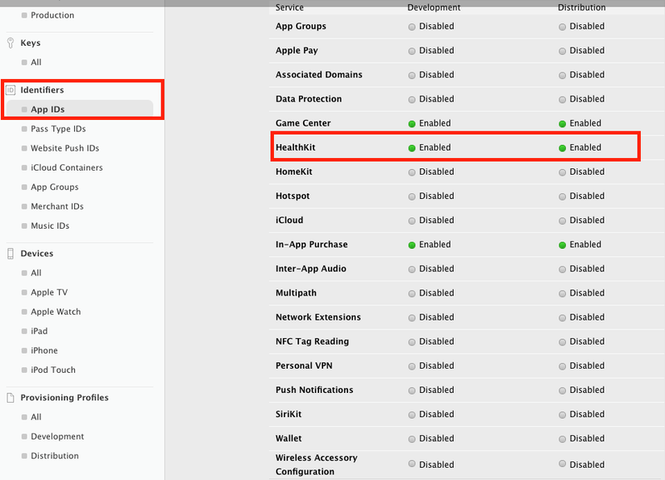
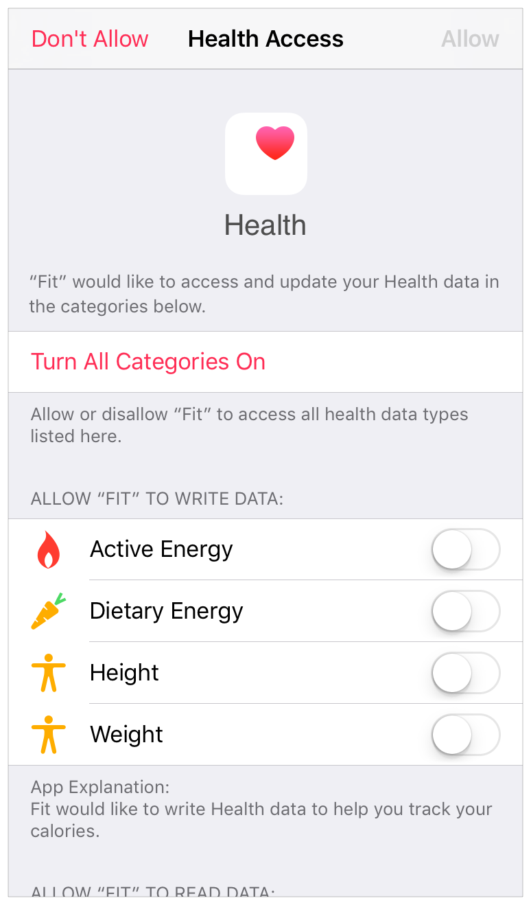

# HeathKit

1. Tổng quan:

- Là 1 API đã được Apple giới thiệu từ phiên bản IOS 8.
- Được thiết kế để chia sẻ những data giữa các app vs nhau 1 cách có ý nghĩa.
- Hoạt động như 1 kho trung tâm cho tất cả dữ liệu liên quan đến sức khoẻ, cho phép người dùng xây dựng hồ sơ sinh học và tập luyện workouts.
- Framework ép buộc người dùng phải sử dụng các loại data và units đã được định sẵn, do đó họ không thể tự ý custom hay khởi tạo loại data hay uint được. 
- Dù các data và unit đã được giới hạn trước nhưng HeathKit có 1 số lượng data types và units rất đa dạng.
- HealthKit hiện nay chưa được tích hợp trên iPad

2. Các bước chuẩn bị:

2.1 Entitlements: 

- HealthKit cũng nằm trong một bộ các quyền lợi riêng gọi là entitlements, bạn sẽ cần phải cho phép nó được sử dụng trong ứng dụng. Đầu tiên bạn phải vào Apple develop account , thiết lập HealthKit là enable cho bunder identifier sử dụng cho ứng dụng của bạn 
 
 
 
 - Sau đó, quay trở lại Xcode, mở tab Capabilities trong target editor, bạn bật HealthKit switch lên, sẽ cần chờ đợi trong giây lát đề Xcode cấu hình HealthKit 
 
 - Tiếp theo mở Infor.plist thêm vào key NSHealthUpdateUsageDescription -> Privacy – Health Share Usage Description và NSHealthShareUsageDescription -> Privacy – Health Update Usage Description

 2.2 Enable HeathKit trong app:
 
  * Note: Chỉ enbale Clincal Heath Records khi app sử dụng dữ liệu liên quan đến bệnh trạng của user, nếu không app khi đẩy lên sẻ review fail.
  
  
2.3 Ensure HealthKit’s Availability

- Sử dụng method isHealthDataAvailable() để chắc chắn HeathKit đã avaible trên thiết bị của người dùng 

        if HKHealthStore.isHealthDataAvailable() {
            // Add code to use HealthKit here.
        }

2.4 Create the HealthKit Store

- Nếu HealthKit đã được enbale và avaible trên thiết, khởi tạpo HKHeathStore object trên app:

        let healthStore = HKHealthStore()

3. Xin quyền đọc và share data 

- Yêu cầu permission các data và unit cần sủ dụng từ user:

        let allTypes = Set([HKObjectType.workoutType(),
                            HKObjectType.quantityType(forIdentifier: .activeEnergyBurned)!,
                            HKObjectType.quantityType(forIdentifier: .distanceCycling)!,
                            HKObjectType.quantityType(forIdentifier: .distanceWalkingRunning)!,
                            HKObjectType.quantityType(forIdentifier: .heartRate)!])

        healthStore.requestAuthorization(toShare: allTypes, read: allTypes) { (success, error) in
            if !success {
                // Handle the error here.
            }
        }

- Mỗi lần app yêu cầu quyền mới, màn hình hệ thống sẽ hiển thị màn hình như sau:

4. Demo 

