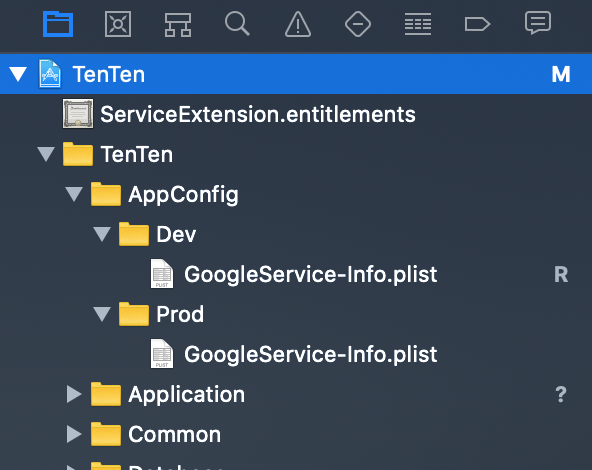

# Hướng dẫn thiết lập nhiều môi trường cho iOS ( chia theo Schemes)

# Mục lục

1. [Tạo thêm Configuration mới](#1-t%E1%BA%A1o-th%C3%AAm-configuration-m%E1%BB%9Bi)
2. [Tạo Scheme mới](#2-t%E1%BA%A1o-scheme-m%E1%BB%9Bi)
3. [Thiết lập config build cho Scheme](#3-thi%E1%BA%BFt-l%E1%BA%ADp-config-build-cho-scheme)
4. [Thiết lập Info.plist theo Scheme](#4-thi%E1%BA%BFt-l%E1%BA%ADp-infoplist-theo-scheme)
5. [Thiết lập Firebase config theo Schemes tương ứng](#5-thi%E1%BA%BFt-l%E1%BA%ADp-firebase-config-theo-schemes-t%C6%B0%C6%A1ng-%E1%BB%A9ng)
6. [Thiết lập hiển thị tên app theo Scheme tương ứng](#6-thi%E1%BA%BFt-l%E1%BA%ADp-hi%E1%BB%83n-th%E1%BB%8B-t%C3%AAn-app-theo-scheme-t%C6%B0%C6%A1ng-%E1%BB%A9ng)
7. [Thiết lập App Groups theo Scheme tương ứng](#7-thi%E1%BA%BFt-l%E1%BA%ADp-app-groups-theo-scheme-t%C6%B0%C6%A1ng-%E1%BB%A9ng)

# Nội dung

## 1. Tạo thêm Configuration mới

Trong setting của project TenTen, chọn phần project, tab Info, tìm phần Configurations, sau đó ấn nút + để thực hiện Duplicate Debug Configuration và đổi tên Debug-production, tương tự Duplicate Release Configuration và đổi tên Release-production


## 2. Tạo Scheme mới

Tạo 1 schemes mới tên TenTen-production với target TenTen và 1 schemes mới Service-Ext-production với target ServiceExt


## 3. Thiết lập config build cho Scheme

Edit 2 schemes mới với config : Run, Test, Analyze chọn build configuration Debug-production, Profile và Archive chọn build configuration Release-production

**a) TenTen_Production**


**b) ServiceExt_Production**


## 4. Thiết lập Info.plist theo Scheme

Clone file Info.plist, để cùng thư mục và sửa tên thành Info-production.plist, add vào project, lưu ý sẽ chỉnh sửa URL Types sau khi có release info


Chỉnh sửa lại tên Bundle Identifier tương ứng


Thêm Flag để phân biệt môi trường trong code Swift

Cho target TenTen


Cho target ServiceExt


Trong code swift sẽ phân loại như sau:

```
#if DEV
    ...
#elseif PRODUCTION
    ...
#else
    ...
#endif
```

## 5. Thiết lập Firebase config theo Schemes tương ứng

Clone file GoogleService-Info.plist, tạo 1 thư mục mới tên là Config, bên trong có 2 thư mục Prod và Dev, mỗi thư mục thêm GoogleService-Info.plist, xóa file google config cũ và link lại thư mục mới



Sau đó chỉnh script như sau:
https://stackoverflow.com/a/48789232


```
PATH_TO_GOOGLE_PLISTS="${PROJECT_DIR}/TenTen/AppConfig"

case "${CONFIGURATION}" in

   "Debug" | "Release" )
        cp -r "$PATH_TO_GOOGLE_PLISTS/Dev/GoogleService-Info.plist" "${BUILT_PRODUCTS_DIR}/${PRODUCT_NAME}.app/GoogleService-Info.plist" ;;

   "Debug_Production" | "Release_Production" )
        cp -r "$PATH_TO_GOOGLE_PLISTS/Prod/GoogleService-Info.plist" "${BUILT_PRODUCTS_DIR}/${PRODUCT_NAME}.app/GoogleService-Info.plist" ;;

    *)
        ;;
esac
```

#### \*\*\*\* Lưu ý trong Target -> Build Phases -> Copy Bundle Resources

Chỉ nên để 1 file GoogleSerivce-Info.plist. Nếu nhiều hơn thì sẽ build lỗi


## 6. Thiết lập hiển thị tên app theo Scheme tương ứng

Dựa theo tài liệu này
https://medium.com/swift2go/different-app-display-name-based-on-xcode-scheme-d709307d0c01

Bước 1: Tạo User-Defined mới


Bước 2: Đặt tên Setting mới là APP_DISPLAY_NAME và điền tên app tương ứng với scheme


Bước 3: Gắn link APP_DISPLAY_NAME trong Bundle Display Name ở cả 2 file Info.plist và Info-Production.plist


## 7. Thiết lập App Groups theo Scheme tương ứng


Do app có 2 target nên sẽ phải config appGroup cho cả 2

**a) Target TenTen**

Tạo 2 file TenTen.entitlements như trong ảnh


Đối với TenTen.entitlements trong Dev có value
group.tenten.serviceextension


Đối với TenTen.entitlements trong Prod có value
group.tenten.serviceextension.product


Sau đó vào Build Settings của target TenTen để link đường dẫn tương ứng


**b) Target ServiceExt**

Tương tự như trên với Dev (group.tenten.serviceextension) và Prod (group.tenten.serviceextension.product) ta sẽ được


