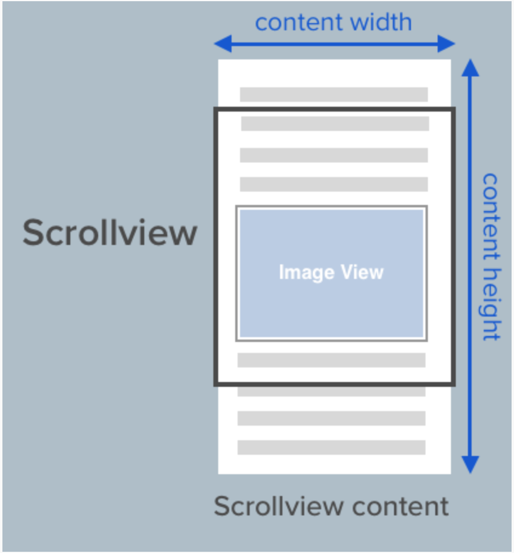
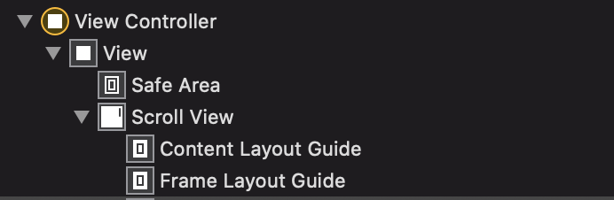
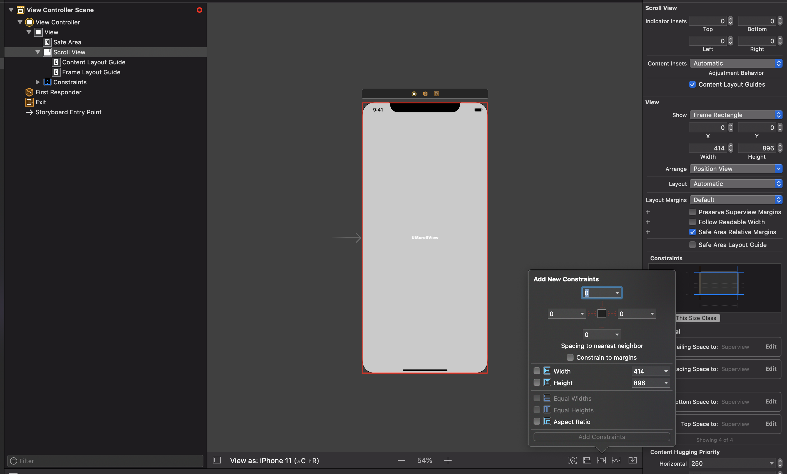
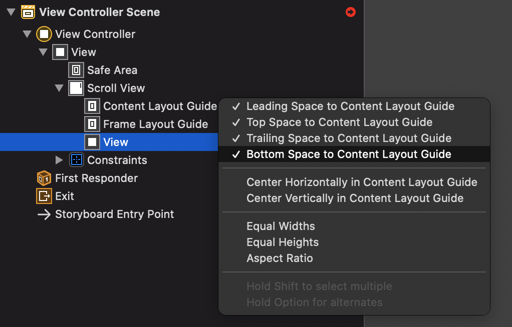
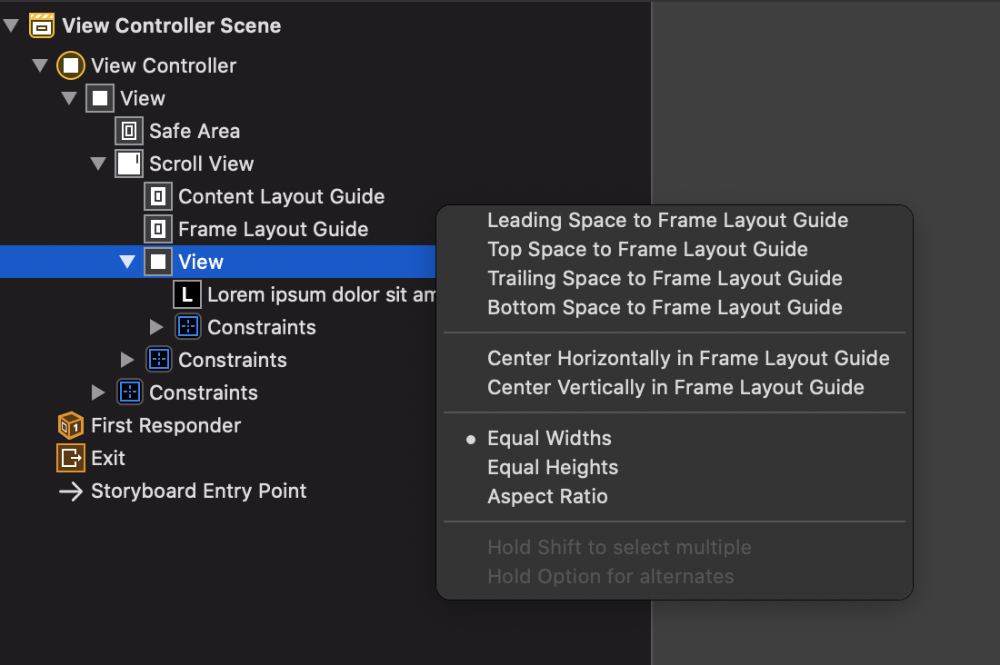
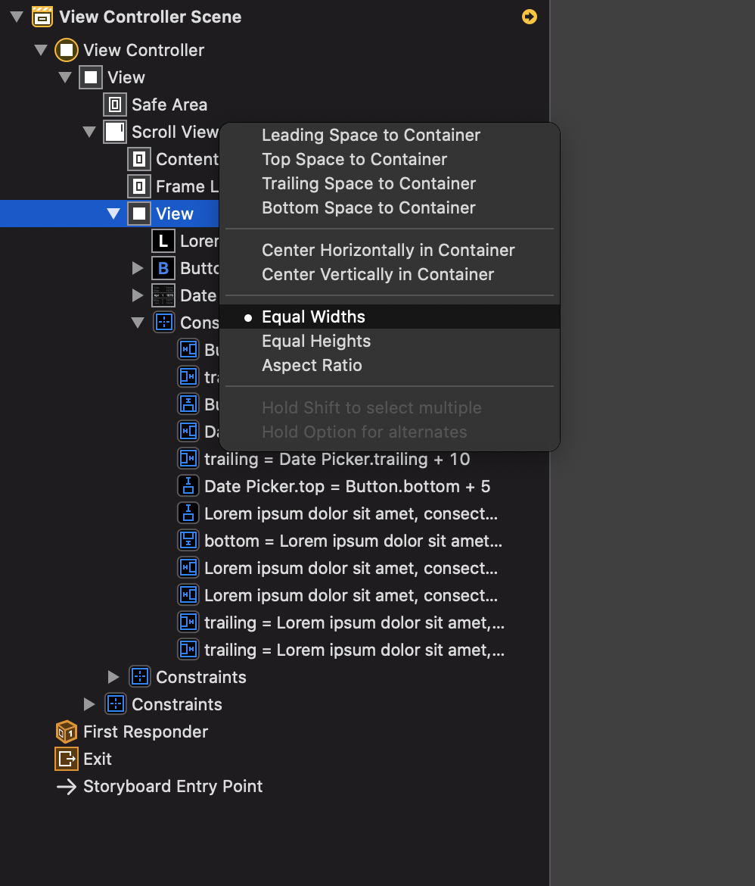
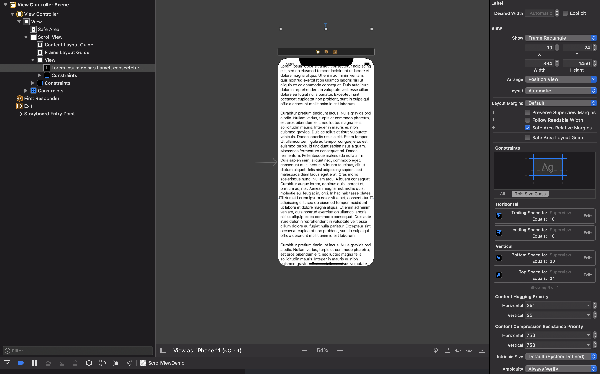

# UIScrollView trong Xcode 11

Đây là doc nói về UIScrollView trong swift và cách sử dụng UIScrollView trong storyboad/XIB. 
(lưu ý: áp dụng trên xcode 11)

1. Cấu trúc của UIScrollVIew: 
- UIScrollView là một view mà nó cho phép cuộn và phóng to nội dung của nó.
- Khi tạo constraint cho scroll view bạn cần tạo constraint cho 2 bước:
    + Bước 1 là cần phải tạo các constraints cố định khung(kích thước và vị trí) của scroll view so với super view của nó.
    + Bước 2 là cần phải tạo các constraint cho các view trong scrollview.

2. Cách đặt Content layout và Frame layout
2.1: Setup UIScrollView
- Từ XCode 11 trở đi Apple đã cho thêm 1 thuộc tính Content Layout Guide cho UIScrollView giúp mọi người tạo constraint cho nó 1 cách dễ dàng hơn. Khi bạn kéo vào 1 UIScrollView ở XCode 11 nó sẽ mặc định được bật tính năng này. Khi này bên trong scroll view sẽ có 2 layout guide là Content Layout guide và Frame Layout Guide

- Điểm khác biệt của việc sử dụng thuộc tính Content Layout Guide so với cách không sử dụng là thay vì nó constraint trực tiếp với ScrollView thì nó lại constraint với các Layout guide của scroll view.
- Bước 1: Kéo 1 ScrollView vào và tạo constraint xác định vị trí, kích thước của ScrollView:

- Bước 2: Kéo view vào trong scrollView và tạo constraint cho các view trong scrollView:

Chúng ta cần kéo vào 1 UIView để chứa tất cả các View.
Lúc này chúng ta sẽ tạo constraint cho View này bằng cách sử dụng 2 thuộc tính của ScrollView là Content Layout guide và Frame Layout guide
+ Content Layout guide: Chọn ContentView sử dụng chuột phải kéo vào Content layout guide và tạo các constraint ContentView với content layout guide leading, top, trailing, bottom như sau:

+ Frame Layout guide: Chọn content View sử dụng chuột phải kéo vào Frame Layout guide và tạo các constraint equal width nếu muốn cuộn dọc hoặc equal height nếu muốn cuộn ngang. 

+ Tiếp theo, do trong trường hợp này mình làm scrollview cuộn theo chiều dọc nên mình sẽ bỏ constraint equal height của view với scrollview đi và set height của content view = 1500 . Ta sẽ được kết quả như hình:

+ Nếu muốn chiều cao hoặc chiều rộng tự động tính theo độ dài của nội dung bên trong, ta set width hoặc heigth của content view bằng với width hoặc height của scrollView. Ở đây ta sẽ set width của content view = width của scrollView để scrollView cuộn theo chiều dọc: 

+ Giờ chúng ta có thể kéo các View mình muốn vào trong view này và sắp xếp chúng theo ý muốn. Ở trường hợp này ta muốn kéo vào 1 label. Nên ta sẽ constraint theo như hình phía dưới.

+ Cho text trong label 1 đoạn text dài để chúng ta có thể thấy rõ được scrollView. Và đây là thành quả: 

