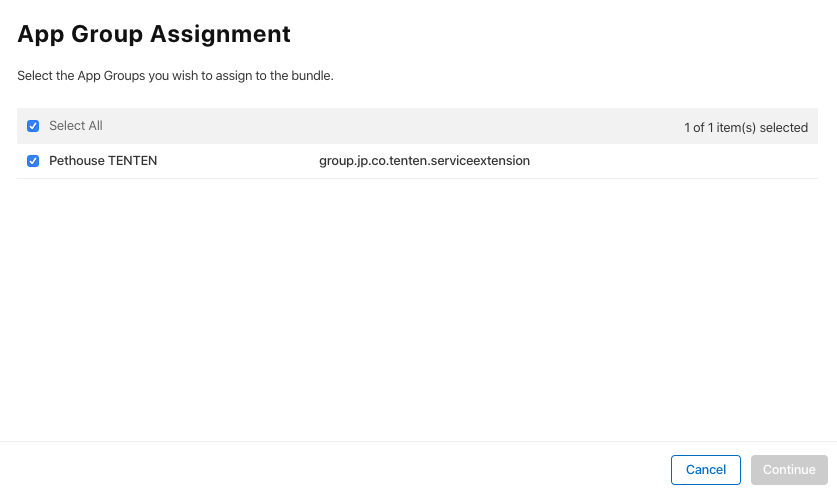

# Hướng dẫn đưa ứng dựng ios lên App Store

Mục lục

I. [Tạo Certificate, appID và Provisioning](#i-t%E1%BA%A1o-certificate-appid-v%C3%A0-provisioning)

1.  [Tạo AppID](#1-t%E1%BA%A1o-appid)
2.  [Tạo Certificates](#2-t%E1%BA%A1o-certificates)
3.  [Tạo Profiles](#3-t%E1%BA%A1o-profiles)
4.  [Gắn APNs Authentication Key hoặc APNs Certificates lên Firebase](#4-g%E1%BA%AFn-apns-authentication-key-ho%E1%BA%B7c-apns-certificates-l%C3%AAn-firebase)

# Giới thiệu

Tài liệu này sẽ hướng dẫn đưa ứng dụng lên App Store cho dự án TenTen và cấu hình account apple developer dựa vào yêu cầu dự án TenTen.

# I. Tạo Certificate, appID và Provisioning

Click vào đây để tạo

## 1. Tạo AppID

### a) Tạo AppID cho target TenTen

Tạo AppID với BundleID = jp.co.tenten

- Do app cần dùng chung realm database với ServiceExt (https://gitlab.impl.vn/tu.nguyen/ios_handbook/tree/master/ManagingDifferentEnviroments#1-t%E1%BA%A1o-th%C3%AAm-configuration-m%E1%BB%9Bi) nên sẽ phải sử dụng appGroup

Tương ứng với AppGroup với

Đây là setting chi tiết trong xcode

[Thiết lập App Groups theo Scheme tương ứng](https://gitlab.impl.vn/tu.nguyen/ios_handbook/tree/master/ManagingDifferentEnviroments#7-thi%E1%BA%BFt-l%E1%BA%ADp-app-groups-theo-scheme-t%C6%B0%C6%A1ng-%E1%BB%A9ng)

- Bên cạnh đó, App sử dụng Firebase Messaging để nhận notification nên sẽ phải bật **Push Notification** lên

Phần cấu hình certificate cho notification ở phần tiếp (đây là link)

### b) Tạo AppID cho target ServiceExt

Tương tự như trên nhưng sẽ không cần chọn Push Notification nữa

## 2. Tạo Certificates

### a) Chuẩn bị file Certificate Signing Request

Mở KeyChain Access trên máy mac

Tạo certificate infomation

Chọn saved to disk để lưu file trên ổ cứng

Sau khi ấn continue bạn sẽ được file \*.certSigningRequest để tạo certificate trên apple developer

### b) Tạo Certificates trên Apple Developer

Các bạn sẽ phải tạo 2 certificate (Development và Distribution)

Khi bạn tạo xong 2 certificate (Development và Distribution) thì sẽ có kết quả như sau

### c) Tạo certificate cho Push Notification

Tạo certificate như ở trên cho 2 môi trường Development và Production. Kết quả được như sau

Tải 4 certificate trên và click từng cái thì KeyChain Access sẽ nhận được trong máy bạn

## 3. Tạo Profiles

Các bạn cần tạo ít nhất 3 môi trường (Development, Ad Hoc và App Store ) cho 2 Indentifiers jo.co.tenten và jo.co.tenten.ServiceExt

Kết quả sẽ được 6 profiles như trên. Tải hết 6 cái để cài

Trên Xcode sẽ được như sau

## 4. Gắn APNs Authentication Key hoặc APNs Certificates lên Firebase

### a) APNs Authentication Key

là file \*.p8 và cách tạo như sau

Sau đó bạn sẽ tải file \*.p8 về máy. Lưu ý chỉ tải được 1 lần

Lên trang Firebase Console https://console.firebase.google.com/

Upload file p8 lên đây

### b) APNs Certificates

là file \*.p12

Vào KeyChain Access để xuất file p12 cho 2 môi trường Development và Production

Nhớ đặt mật khẩu nhé :)

Lên trang Firebase Console https://console.firebase.google.com/

Upload 2 file p12 đó lên đây

