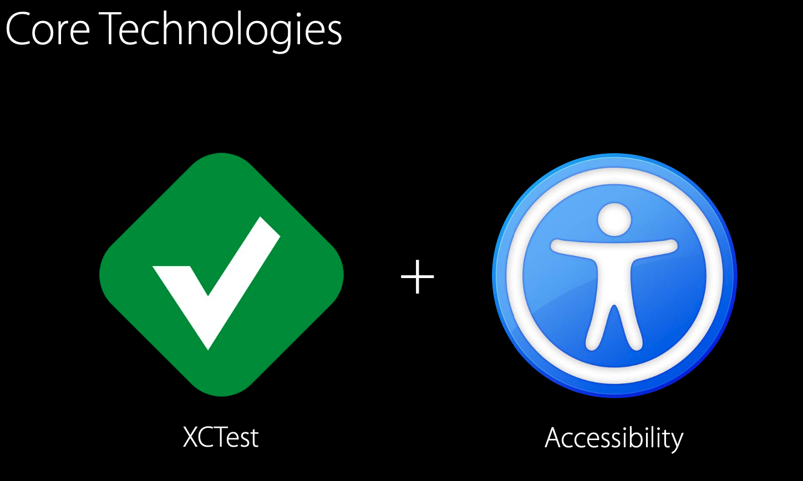

# Những điều cơ bản về UI Testing 

Clip cơ bản cho người mới học https://developer.apple.com/videos/play/wwdc2015/406/
Document:
https://devstreaming-cdn.apple.com/videos/wwdc/2015/406o0doszwo8r15m/406/406_ui_testing_in_xcode.pdf?dl=1 

# I. Trước khi xem clip

Chỉ biết là cách thay thế cho người thật cho quá trình test. Ngoài ra trong quá trình tìm hiểu thấy có ít tài liệu về UI Testing => Thấy khó hơn viết Unit Testing

Nhưng vấn đề chưa rõ là 

1. Không biết cách code để chạy tuần tự như thao tác người dùng ???

2. Không biết cách điền vào ô nhập text hay click (vuốt, zoom) 1 view như thế nào bằng code UI Testing ?

3. Không biết cách gọi tên định danh cho 1 view ra bằng code như thế nào ?

# II. Sau khi xem xong nắm bắt được những điều sau và có lời giải cho 3 câu hỏi trên

1. Cách làm UI Testing. Chỉ ra cách viết code như thế nào cho hợp lý

2. UI Recording -> Tool này sẽ hỗ trợ genarate  code cho UI Testing khi ấn trên iphone hay simulator
3. Xem báo cáo Test report

--> Phần Demo cho (1), (2), (3) ở phút 6:00 -> 12:00 trong https://developer.apple.com/videos/play/wwdc2015/406/ 

4. Core của UI Testing là 

 Vậy nên cần lưu ý phần dưới đây trong xcode để giúp quá trình code UI Testing cho thuận tiện 

Trường Accessibity phải được enabled nếu muốn việc code cho UI Testing thuận tiện 

5. Toàn bộ UI Testing nằm ở 3 vấn đề cốt lõi sau

6. Dễ dàng query thì bạn phải nhìn thấy được Element Hierarchy của app

Phần Demo  ở phút 28:10 -> 42:40 trong https://developer.apple.com/videos/play/wwdc2015/406/
sẽ là phần nâng cao để viết 1 ui testing phức tạp và cách sử dụng Accessibility Inspector để chỉ ra cách debug Element Hierarchy dễ dàng nhất 

Chú ý cách dùng  Accessibility Inspector đang gặp lỗi trên xcode 11 trở đi vậy nên hãy dùng cách dưới đây để tìm ra  Element Hierarchy

https://stackoverflow.com/questions/38980209/how-to-inspect-element-for-xcode-ui-test-like-appium-inspector

Cách đơn giản nhất để gọi view trong ui testing là 

